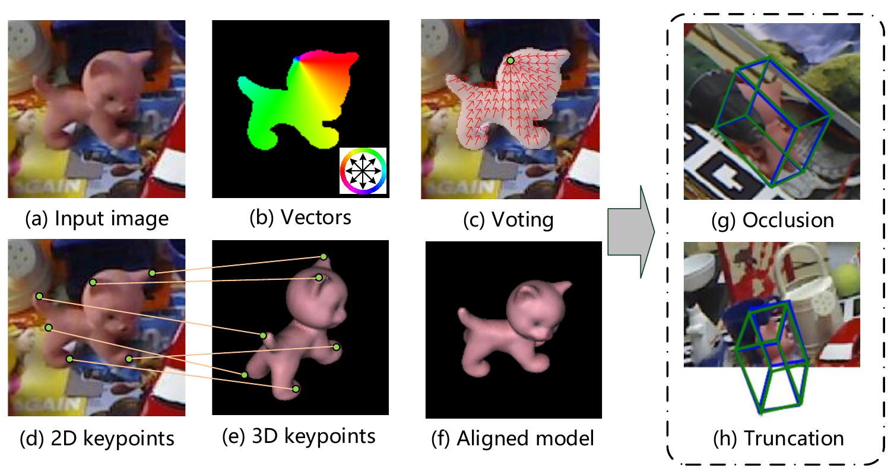
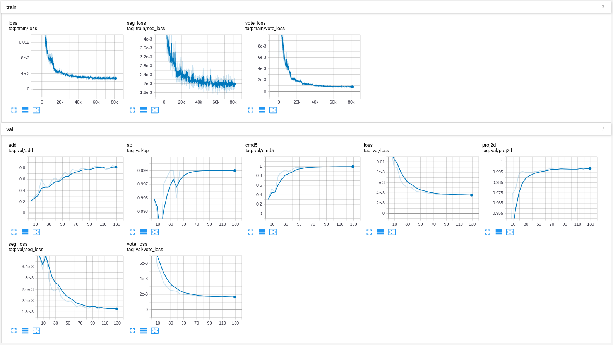

# PVNet: Pixel-wise Voting Network for 6DoF Pose Estimation



> [PVNet: Pixel-wise Voting Network for 6DoF Pose Estimation](https://arxiv.org/pdf/1812.11788.pdf)  
> Sida Peng, Yuan Liu, Qixing Huang, Xiaowei Zhou, Hujun Bao   
> CVPR 2019 oral  
> [Project Page](https://zju3dv.github.io/pvnet)

Any questions or discussions are welcomed!

## Introduction

Thanks [Haotong Lin](https://github.com/haotongl) for providing the clean version of PVNet and reproducing the results.

The structure of this project is described in [project_structure.md](project_structure.md).

## Installation

1. Set up the python environment:
    ```
    conda create -n pvnet python=3.7
    conda activate pvnet

    # install torch 1.1 built from cuda 9.0
    pip install torch==1.1.0 -f https://download.pytorch.org/whl/cu90/stable

    pip install Cython==0.28.2
    pip install -r requirements.txt
    ```
2. Compile cuda extensions under `lib/csrc`:
    ```
    ROOT=/path/to/clean-pvnet
    cd $ROOT/lib/csrc
    export CUDA_HOME="/usr/local/cuda-9.0"
    cd dcn_v2
    python setup.py build_ext --inplace
    cd ../ransac_voting
    python setup.py build_ext --inplace
    cd ../fps
    python setup.py
    ```
3. Set up datasets:
    ```
    ROOT=/path/to/clean-pvnet
    cd $ROOT/data
    ln -s /path/to/linemod linemod
    ln -s /path/to/linemod_orig linemod_orig
    ln -s /path/to/occlusion_linemod occlusion_linemod
    ```

Download dataset:
1. [linemod](https://zjueducn-my.sharepoint.com/:u:/g/personal/pengsida_zju_edu_cn/EXK2K0B-QrNPi8MYLDFHdB8BQm9cWTxRGV9dQgauczkVYQ?e=beftUz)
2. [linemod_orig](https://zjueducn-my.sharepoint.com/:u:/g/personal/pengsida_zju_edu_cn/EaoGIPguY3FAgrFKKhi32fcB_nrMcNRm8jVCZQd7G_-Wbg?e=ig4aHk): The dataset includes the depth for each image.
3. [occlusion linemod](https://zjueducn-my.sharepoint.com/:u:/g/personal/pengsida_zju_edu_cn/ESXrP0zskd5IvvuvG3TXD-4BMgbDrHZ_bevurBrAcKE5Dg?e=r0EgoA)
4. [truncation linemod](https://1drv.ms/u/s!AtZjYZ01QjphfuDICdni1IIM4SE): Check [TRUNCATION_LINEMOD.md](TRUNCATION_LINEMOD.md) for the information about the Truncation LINEMOD dataset.


## Testing

Take the testing on `cat` as an example.

1. Prepare the data related to `cat`:
    ```
    python run.py --type linemod cls_type cat
    ```
2. Download the pretrained model of `cat` and put it to `$ROOT/data/model/pvnet/cat/199.pth`.
3. Test:
```
python run.py --type evaluate --cfg_file configs/linemod.yaml model cat
python run.py --type evaluate --cfg_file configs/linemod.yaml test.dataset LinemodOccTest model cat
```
4. Test with icp:
```
python run.py --type evaluate --cfg_file configs/linemod.yaml model cat test.icp True
python run.py --type evaluate --cfg_file configs/linemod.yaml test.dataset LinemodOccTest model cat test.icp
```

## Visualization

Take the testing on `cat` as an example.

1. Prepare the data related to `cat`:
    ```
    python run.py --type linemod cls_type cat
    ```
2. Download the pretrained model of `cat` and put it to `$ROOT/data/model/pvnet/cat/199.pth`.
3. Visualize:
```
python run.py --type visualize --cfg_file configs/linemod.yaml model cat
```

If setup correctly, the output will look like


## Training

### Training

1. Prepare the data related to `cat`:
    ```
    python run.py --type linemod cls_type cat
    ```
2. Train:
    ```
    python train_net.py --cfg_file configs/linemod.yaml model mycat cls_type cat
    ```

The training parameters can be found in [project_structure.md](project_structure.md).

### Tensorboard

```
tensorboard --logdir data/record/pvnet
```

If setup correctly, the output will look like




## Training on the custom dataset

1. Prepare a dataset as the following structure:
    ```
    ├── /path/to/dataset
    │   ├── model.ply
    │   ├── camera.txt
    │   ├── rgb/
    │   │   ├── 0.jpg
    │   │   ├── ...
    │   │   ├── 1234.jpg
    │   │   ├── ...
    │   ├── mask/
    │   │   ├── 0.png
    │   │   ├── ...
    │   │   ├── 1234.png
    │   │   ├── ...
    │   ├── pose/
    │   │   ├── 0.npy
    │   │   ├── ...
    │   │   ├── 1234.npy
    │   │   ├── ...
    │   │   └──
    ```
2. Create a soft link pointing to the dataset:
    ```
    ln -s /path/to/custom_dataset data/custom
    ```
3. Process the dataset:
    ```
    python run.py --type custom
    ```
4. Train:
    ```
    python train_net.py --cfg_file configs/linemod.yaml train.datset CustomTrain test.dataset CustomTrain model mycat train.batch_size 4
    ```
5. Watch the training curve:
    ```
    tensorboard --logdir data/record/pvnet
    ```

An example dataset can be downloaded at [here](https://zjueducn-my.sharepoint.com/:u:/g/personal/pengsida_zju_edu_cn/EXkFCvV2J0BBtlwKSyC20b4BdyPm3LTYqIZ-vnVTGJMGtg?e=WC2Cgm).

## Citation

If you find this code useful for your research, please use the following BibTeX entry.

```
@inproceedings{peng2019pvnet,
  title={PVNet: Pixel-wise Voting Network for 6DoF Pose Estimation},
  author={Peng, Sida and Liu, Yuan and Huang, Qixing and Zhou, Xiaowei and Bao, Hujun},
  booktitle={CVPR},
  year={2019}
}
```
